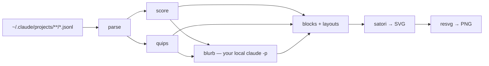

```
  █████╗  ██████╗ ███████╗███╗   ██╗████████╗
 ██╔══██╗██╔════╝ ██╔════╝████╗  ██║╚══██╔══╝
 ███████║██║  ███╗█████╗  ██╔██╗ ██║   ██║
 ██╔══██║██║   ██║██╔══╝  ██║╚██╗██║   ██║
 ██║  ██║╚██████╔╝███████╗██║ ╚████║   ██║
 ╚═╝  ╚═╝ ╚═════╝ ╚══════╝╚═╝  ╚═══╝   ╚═╝
 ██╗    ██╗██████╗  █████╗ ██████╗ ██████╗ ███████╗██████╗
 ██║    ██║██╔══██╗██╔══██╗██╔══██╗██╔══██╗██╔════╝██╔══██╗
 ██║ █╗ ██║██████╔╝███████║██████╔╝██████╔╝█████╗  ██║  ██║
 ██║███╗██║██╔══██╗██╔══██║██╔═══╝ ██╔═══╝ ██╔══╝  ██║  ██║
 ╚███╔███╔╝██║  ██║██║  ██║██║     ██║     ███████╗██████╔╝
  ╚══╝╚══╝ ╚═╝  ╚═╝╚═╝  ╚═╝╚═╝     ╚═╝     ╚══════╝╚═════╝
```

<div align="center">

### `YOUR CLAUDE CODE MONTH // SCORED, RENDERED, NEVER UPLOADED`

*reads your own transcripts, writes a PNG, phones nobody*

    -f5871f?style=flat-square&labelColor=111111)

</div>

---

## 📊 What is this

Claude Code leaves a JSONL transcript behind for every session it runs. `agent-wrapped` streams all of
them, scores the last 30 days across five axes, and renders the result as a card you can post. There is
no API key, no account, and no upload step. The only process it talks to is the `claude` already on your
PATH, which writes one line of commentary and gets shown to you before anything is saved.

The window is a month rather than a year, because Claude Code prunes transcripts at around 30 days and
there is nothing older left to read. So each run also drops a small snapshot into
`~/.agent-wrapped/history.json` — counts only, never your prompts — which is how a genuine annual card
becomes possible twelve months from now.

Every competing tool leads with a percentile. A percentile needs a server holding everyone else's
numbers, so this shows you the five axis bars the total is made of instead, and you can check the
arithmetic yourself.

```console
nick@agent-wrapped:~$ npx agent-wrapped --layout wide --detail full
[✓] 87/100 · THE MACHINE · consistency + volume
[i] your own tooling called Claude 10,123 times without you
```

## 🎴 The card

| | flag | what it actually does |
|---|---|---|
| 01 | **`--layout`** | `wide` 1200×675 for a feed, `square` 1200×1200, `story` 1080×1920 — three aspect ratios that crop badly nowhere |
| 02 | **`--detail`** | `min` is score and one line, `std` adds quips and stats, `full` adds every axis, model split and tool counts |
| 03 | **`--format`** | `png`, `svg`, or `both`. the svg is glyph paths, so it renders the same on a machine with neither font installed |
| 04 | **`--all`** | writes all nine combinations to a directory, for when you cannot decide |
| 05 | **`--theme`** | six built-in accents, cold to hot, picked by your score — or hand it a `palette.toml` |
| 06 | **`--json`** | the whole breakdown as machine-readable output, writes no files |

## 🔢 The score

Five axes worth 20 each. Volume is capped at a fifth of the total on purpose, so the card is not a
spending leaderboard.

| | axis | what it actually measures |
|---|---|---|
| 01 | **volume** | tokens, on a log curve — a linear one would put everybody except the heaviest user at zero |
| 02 | **consistency** | active days against the window |
| 03 | **depth** | hours of real activity per active day, gaps over 15 minutes discarded |
| 04 | **breadth** | how many separate projects you touched |
| 05 | **orchestration** | subagents spawned |

The archetype comes from your **top two** axes, giving ten combinations — `THE MACHINE`, `THE WAR ROOM`,
`AIR TRAFFIC CONTROL`, and so on. Naming it from a single axis made everyone a metronome, since anyone
who opens Claude Code daily maxes consistency without trying.

Sessions are split into interactive and headless. Files with no mode change and fewer than two prompts
were a script calling `claude -p`, not you sitting there, and counting them together produced 10,637
sessions averaging 73 seconds each.

## 🚀 Run it

Needs Node 20 or newer. Nothing else — no browser, no system binaries.

```bash
npx agent-wrapped
```

From source:

```bash
git clone https://github.com/nitrimandylis/agent-wrapped.git
cd agent-wrapped
bun install
bun src/cli.ts --layout square --detail full
```

It prints the score, the axes, and the blurb, then asks before writing the file. Pass `--yes` if you
trust it, `--no-history` if you would rather it left nothing behind at all.

## 🔩 Under the hood



| layer | path | job |
|---|---|---|
| parse | `src/parse.ts` | one streaming pass over every transcript — tokens, timing, tools, mined facts |
| score | `src/score.ts` | five axes, the curves, and the two-axis archetype |
| quips | `src/quips.ts` | the computed one-liners, ordered most surprising first |
| blurb | `src/blurb.ts` | prompts your local `claude`, falls back to a template when it is missing |
| blocks | `src/blocks.ts` | every element a card can contain, one function each |
| layouts | `src/layouts.ts` | nine manifests naming which blocks go where |
| card | `src/card.ts` | stacks the blocks, emits SVG, rasterises to PNG |
| report | `src/report.ts` | the auditable terminal breakdown and `--json` |
| history | `src/history.ts` | one snapshot per month in `~/.agent-wrapped` |
| check | `src/check.ts` | parse invariants, plus all nine layouts measured for silent clipping |
| skill | `agent-wrapped-cli/` | agent skill, for driving this from Claude Code |

**Stack:** TypeScript · Bun · satori · resvg · ccusage

### Privacy

The default prompt sent to your local `claude` contains aggregate counts, single common words, and
Claude's own session titles. `--deep` opts into sending up to 50 of your actual prompts, and it is off
unless you ask for it. Nothing is sent anywhere else, and the history file stores no prompt text at all.

---

<div align="center">

**[Nick Trimandylis](https://github.com/nitrimandylis)**

`NOTHING LEAVES THE MACHINE`

MIT licensed.

</div>
