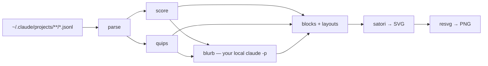

```
  █████╗  ██████╗ ███████╗███╗   ██╗████████╗
 ██╔══██╗██╔════╝ ██╔════╝████╗  ██║╚══██╔══╝
 ███████║██║  ███╗█████╗  ██╔██╗ ██║   ██║
 ██╔══██║██║   ██║██╔══╝  ██║╚██╗██║   ██║
 ██║  ██║╚██████╔╝███████╗██║ ╚████║   ██║
 ╚═╝  ╚═╝ ╚═════╝ ╚══════╝╚═╝  ╚═══╝   ╚═╝
 ██╗    ██╗██████╗  █████╗ ██████╗ ██████╗ ███████╗██████╗
 ██║    ██║██╔══██╗██╔══██╗██╔══██╗██╔══██╗██╔════╝██╔══██╗
 ██║ █╗ ██║██████╔╝███████║██████╔╝██████╔╝█████╗  ██║  ██║
 ██║███╗██║██╔══██╗██╔══██║██╔═══╝ ██╔═══╝ ██╔══╝  ██║  ██║
 ╚███╔███╔╝██║  ██║██║  ██║██║     ██║     ███████╗██████╔╝
  ╚══╝╚══╝ ╚═╝  ╚═╝╚═╝  ╚═╝╚═╝     ╚═╝     ╚══════╝╚═════╝
```

<div align="center">

### `YOUR CLAUDE CODE MONTH // SCORED, RENDERED, NEVER UPLOADED`

*reads your own transcripts, writes a PNG, phones nobody*

    


*a real card — `--layout square --detail full --theme magenta`*

</div>

---

## 📊 What is this

Claude Code leaves a JSONL transcript behind for every session it runs. `agent-wrapped` streams all of
them, scores the last 30 days across five axes, and renders the result as a card you can post. There is
no API key, no account, and no upload step. The only process it talks to is the `claude` already on your
PATH, which writes one line of commentary and gets shown to you before anything is saved.

The window is a month rather than a year, because Claude Code prunes transcripts at around 30 days and
there is nothing older left to read. So each run also drops a small snapshot into
`~/.agent-wrapped/history.json` — counts only, never your prompts — which is how a genuine annual card
becomes possible twelve months from now.

Every competing tool leads with a percentile. A percentile needs a server holding everyone else's
numbers, so this shows you the five axis bars the total is made of instead, and you can check the
arithmetic yourself.

```console
nick@agent-wrapped:~$ npx @nitrimandylis/agent-wrapped --layout wide --detail full
[✓] 87/100 · THE MACHINE · consistency + volume
[i] your own tooling called Claude 10,123 times without you
```

## 🧨 Why this exists

In July 2026 I ran `npx standout` to make one of those AI Wrapped cards. Then I read the bundle it had
just executed. Here is what `dist/cli.js` v0.7.1 does.

**It uploads your prompts.** Not counts, not summaries — text. Up to 500 paired exchanges, your prompt
truncated at 2,000 characters and the assistant reply at 800, plus roughly 50 standalone prompt samples,
POSTed to `standout.work/api/public/agent-submit`.

**It reads past your transcripts.** `~/.claude/projects/*.jsonl`, Codex and Cursor history,
`.claude/settings*.json`, your skills and commands directories.

**Its redaction only catches credentials.** `redactSecrets()` matches key-shaped strings. Names, clients,
and anything personal you happened to type pass through verbatim, and can surface again in the blurb it
generates for you.

**It schedules itself.** `maybeAutoInstallSchedule()` writes `~/Library/LaunchAgents/work.standout.monthly.plist`,
which wakes hourly and re-runs `npx -y standout@latest` every month. You learn this from a single stderr
line printed after it has already been installed. `npx standout schedule off` removes it.

To be fair on one point: the upload *is* disclosed, and accurately, at
`standout.work/privacy-policy/standout`. The trouble is that the CLI's own Y/n prompt links to `/terms`
and `/privacy-policy`, and neither of those pages mentions the CLI at all. The launchd agent is disclosed
nowhere.

None of that is necessary to draw a PNG. Every number on that card can be computed on the machine that
already holds the data. So this one reads the same transcripts, does the same arithmetic, and the only
thing that ever leaves the process is a prompt handed to the `claude` binary you already installed —
which you get to read on screen before anything is written.

The rule I came away with: no marketing CLI gets to read `~/.claude`. Local, open source, and
inspectable, or it does not run. This is what that looks like.

### A note on the name

npm will not take `agent-wrapped` as a package name. It strips hyphens when comparing, and an
`agentwrapped` already exists — no relation to this project, and worth knowing about since the names
collapse to the same string.

That one is published to npm from an `experience@merge.dev` address, which is checkable with
`npm view agentwrapped maintainers`. Nothing inside the package mentions Merge.dev at all: it brands
itself as agentwrapped.com, reads your usage through `ccusage`, then POSTs a recap to its own API so it
can hand you a shareable link. It describes that recap as anonymized, and it may well be. There is no
public repository, so you cannot open the source and check. It has not been touched since two days
after it launched.

Which is the whole argument, again. This one is scoped to `@nitrimandylis` because the bare name was
unavailable, and every line of it is in this repo.

## 🎴 The card

| | flag | what it actually does |
|---|---|---|
| 01 | **`--layout`** | `wide` 1200×675 for a feed, `square` 1200×1200, `story` 1080×1920 — three aspect ratios that crop badly nowhere |
| 02 | **`--detail`** | `min` is score and one line, `std` adds quips and stats, `full` adds every axis, model split and tool counts |
| 03 | **`--format`** | `png`, `svg`, or `both` — [same card as SVG](https://raw.githubusercontent.com/nitrimandylis/agent-wrapped/main/docs/card-square-full.svg). glyph paths, so it renders the same on a machine with neither font installed |
| 04 | **`--all`** | writes all nine combinations to a directory, for when you cannot decide |
| 05 | **`--theme`** | six built-in accents, cold to hot, picked by your score — or hand it a `palette.toml` |
| 06 | **`--json`** | the whole breakdown as machine-readable output, writes no files |

## 🔢 The score

Five axes worth 20 each. Volume is capped at a fifth of the total on purpose, so the card is not a
spending leaderboard.

| | axis | what it actually measures |
|---|---|---|
| 01 | **volume** | tokens, on a log curve — a linear one would put everybody except the heaviest user at zero |
| 02 | **consistency** | active days against the window |
| 03 | **depth** | hours of real activity per active day, gaps over 15 minutes discarded |
| 04 | **breadth** | how many separate projects you touched |
| 05 | **orchestration** | subagents spawned |

The archetype comes from your **top two** axes, giving ten combinations — `THE MACHINE`, `THE WAR ROOM`,
`AIR TRAFFIC CONTROL`, and so on. Naming it from a single axis made everyone a metronome, since anyone
who opens Claude Code daily maxes consistency without trying.

Sessions are split into interactive and headless. Files with no mode change and fewer than two prompts
were a script calling `claude -p`, not you sitting there, and counting them together produced 10,637
sessions averaging 73 seconds each.

## 🚀 Run it

Needs Node 20 or newer. Nothing else — no browser, no system binaries.

```bash
npx @nitrimandylis/agent-wrapped
```

The package is scoped because npm considers the bare name too similar to an existing one. Installed
globally, the command is just `agent-wrapped`.

From source:

```bash
git clone https://github.com/nitrimandylis/agent-wrapped.git
cd agent-wrapped
bun install
bun src/cli.ts --layout square --detail full
```

It prints the score, the axes, the name it is about to put on the card, and the blurb, then asks before
writing the file. Pass `--yes` if you trust it, `--no-history` if you would rather it left nothing behind
at all.

The name defaults to your GitHub login, read out of `gh`'s own config file on disk rather than from the
GitHub API — a lookup that phoned home would make the sentence above this one false. With no `gh`, it
falls back to your system username. `--handle <name>` overrides both.

## 🔩 Under the hood



| layer | path | job |
|---|---|---|
| parse | `src/parse.ts` | one streaming pass over every transcript — tokens, timing, tools, mined facts |
| score | `src/score.ts` | five axes, the curves, and the two-axis archetype |
| quips | `src/quips.ts` | the computed one-liners, ordered most surprising first |
| blurb | `src/blurb.ts` | prompts your local `claude`, falls back to a template when it is missing |
| blocks | `src/blocks.ts` | every element a card can contain, one function each |
| layouts | `src/layouts.ts` | nine manifests naming which blocks go where |
| card | `src/card.ts` | stacks the blocks, emits SVG, rasterises to PNG |
| report | `src/report.ts` | the auditable terminal breakdown and `--json` |
| history | `src/history.ts` | one snapshot per month in `~/.agent-wrapped` |
| check | `src/check.ts` | parse invariants, plus all nine layouts measured for silent clipping |
| skill | `agent-wrapped-cli/` | agent skill, for driving this from Claude Code |

**Stack:** TypeScript · Bun · satori · resvg · ccusage

### Privacy

There is no server, so there is no upload path to audit — but the specifics, since that is the whole
point of the thing:

- The prompt sent to your local `claude` carries aggregate counts, single common words, and Claude's own
  session titles. `--deep` opts into including up to 50 of your actual prompts and is off unless you ask.
- The blurb is printed in your terminal for approval before any file is written. `--yes` skips the
  approval, never the locality.
- `~/.agent-wrapped/history.json` stores counts, not text: no prompts, no session titles, not even
  project names. `--no-history` writes nothing at all.
- Nothing is scheduled, no launch agent is installed, and no network call is made at any point. `ccusage`
  runs with `--offline`.

It is about 2,300 lines of TypeScript across thirteen files. Read it before you run it — that being the
advice that produced this repo in the first place.

---

<div align="center">

**[Nick Trimandylis](https://github.com/nitrimandylis)**

`NOTHING LEAVES THE MACHINE`

MIT licensed.

</div>
